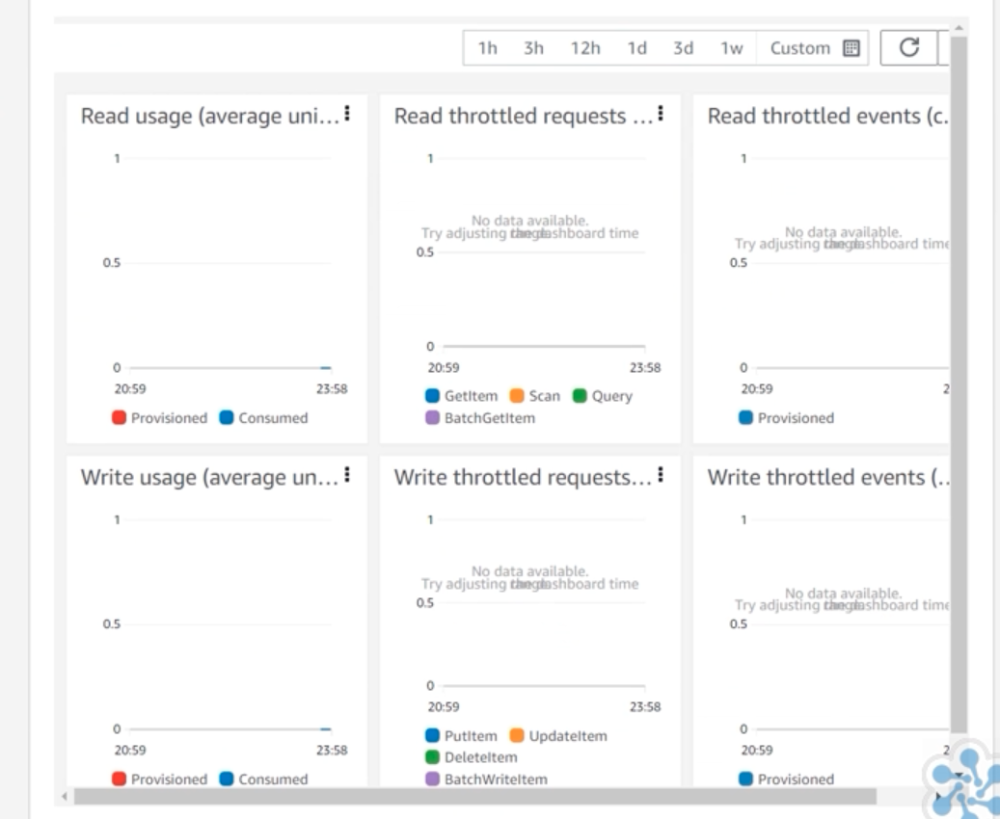

## AWS DynamoDB - Overview

* Components of dynamodb
  * Tables, items, and attributes are the core components 
* Fully managed proprietary NoSQL database service that supports key-value and document data structures
* Supported local secondary index, recently global secondary index
* Automatically replicated across three different availability zones within an AWS Region.
  * Generally replicates within few milliseconds
* Automatically partition data and incoming traffic across multiple partitions which are themselves stored on numerous backend servers distributed across three availability zones within a single region.
* What is the consistency model of DynamoDB?
  * Eventual vs Strong consistency
  * Read can choose the consistency model depending on demand
  * Eventually consistent reads (the default, high throughput)
  * Strongly consistent reads (read from master, low throughput)
* It supports ACID transaction as well
* Keyvalue and document-db style

## 


## When to use?
* It is for OLTP
  * High scalability
  * High durability
* Maximum items size - 400KB


## DynamoDB Units
* **Read unit** - One read request unit represents one strongly consistent read request, or two eventually consistent read requests, for an item up to 4 KB in size.
* **write unit** - One write request unit represents one write for an item up to 1 KB in size.
* Use-cases
  * Transactional read requests require 2 read request units to perform one read for items up to 4 KB. 
  * if item size is 8 KB
    * 2 read request units to sustain one strongly consistent read
    * 1 read request unit if you choose eventually consistent reads
    * 4 read request units for a transactional read request
  * Transactional write requests require 2 write request units to perform one write for items up to 1 KB.
  * if your item size is 2 KB
    * 2 write request units to sustain one write request
    * 4 write request units for a transactional write request
* Which of the following best describes on-demand capacity mode?
  * This mode enables DynamoDB, the service, to specify how many reads and writes you require for your application.
* How do cloud database-as-a-service (DBaaS) options like Amazon RDS and DynamoDB differ from on-premise databases?
  * AWS database services offer Incremental license costs instead of full license costs.
  * AWS database services manage the underlying infrastructure. 
  * AWS database services offer a pay-for-use pricing model.

## DynamoDB
* Table
  * Table class
    * DynamoDB Standard
    * DynamoDB Standard-IA
* Items (rows)
  * All items need partition key
  * Varying attributes are allowed between items
* Sort key
  * In addition to sort-key
* Primary_Key = Partition_Key + sort-key
* Data types
  * Strings
  * Numbers
  * Boolean values
  * Binary data
  * Null values
  * Lists
  * Maps
  * Sets
  * Dates are represented as string (not built-in support)

## DynamoDB Keys

* Partition key – A simple primary key, composed of one attribute known as the partition key. 
* Partition key and sort key – Referred to as a composite primary key, this type of key is composed of two attributes. 
  * The first attribute is the partition key
  * The second attribute is the sort key.
* Also gives document-access pattern as well


## Partition Capacity RCU vs WCU, Throttle
* Partition-Key
    * Helps to find the node (internal to DynamoDB)
    * Maximum partition-key would be equivalent to 10GB
* DynamoDB automatically creates new partition
    * when size of any partition goes above 10GB
    * or RCU > 3000 or WCU > 1000 (Each partition gets this capacity)
* Capacity is divided among all the partition
  * if we have 4 partition (400 RCU and 400 WCU), They are split among each partition
    * 100 RCU, 100 WCU for each table
* ProvisionedThroughputExceededException
  * When partition crosses its capacity due to Throttling
  * AWS SDK uses exponential back-off
* BurstCapacity
  * Only for short period of time (above throughput of the partition)
* AdaptiveCapacity
  * Enables the hot partition to consume more throughput indefinitely
* How to avoid capacity issues? (3 choices)
  * Over provision than required
  * DAX 
  * Use proper partition-key
* 

## DynamoDB PartiQL
* SQL like language

## [How to interact](https://docs.aws.amazon.com/amazondynamodb/latest/developerguide/CheatSheet.html)
1. AWS Console
2. AWS CLI
3. Write code using AWS SDK
   4. Java/javascript/nodejs
4. Nosql workbench for dynamodb
5. API
   6. CreateTable
   7. Control Plane operation
      8. ListTable
      9. DescribeTable
      10. Create/Update/DeleteTable
   11. Data plane operations
       12. GetItem API
       14. BatchGetItem API
       15. Read
           15. Query
               16. PartitionKey + <Sort-key> (optional)
               17. You can also add filter
           18. Scan
               19. (Most expensive call)
               20. Reads every item on the table (or index)
               21. Returns data attributes for the items that match the filter expression
               22. When query is not possible, use scan
           20. PartiQL
       21. Write
           22. PutItem API
           23. UpdateItem
           24. DeleteItem
           25. BatchWriteItem
           26. PartiQL
       27. TXN Operation
           28. TransactGetItems
           29. TransactWriteItems
           30. PartiQL

## DynamoDB put-item
1. import csv from S3 into new table is possible
```python
'''Put item'''

import json
import logging
import os

import boto3
from botocore.config import Config

log_level = os.environ.get('LOG_LEVEL', 'INFO')
logging.root.setLevel(logging.getLevelName(log_level))  # type: ignore
_logger = logging.getLogger(__name__)

# This is actually the default per:
# https://github.com/boto/botocore/blob/15ecfbc7ea23f81981ca65626ee166df130f64db/botocore/data/_retry.json#L119-L126
AWS_CONFIG = Config(retries={'max_attempts': 10})

# DynamoDB
DDB_TABLE_NAME = os.environ.get('DDB_TABLE_NAME')
dynamodb = boto3.resource('dynamodb', config=AWS_CONFIG)
DDT = dynamodb.Table(DDB_TABLE_NAME)


def _put_item(item):
    '''Put record item'''
    DDT.put_item(
        TableName=DDB_TABLE_NAME,
        Item=item
    )


def lambda_handler(event, context):
    '''Function entry'''
    _logger.debug('Event received: {}'.format(json.dumps(event)))

    item = json.loads(event.get('body'))
    _put_item(item)

    resp = {
        'statusCode': 201,
        'body': json.dumps({'success': True})
    }
    _logger.debug('Response: {}'.format(json.dumps(resp)))
    return resp
```

## IAM DynamoDB policy

```json
{
    "Version": "2012-10-17",
    "Statement": [
        {
            "Action": [
                "dynamodb:DescribeStream",
                "dynamodb:GetRecords",
                "dynamodb:GetShardIterator",
                "dynamodb:ListStreams"
            ],
            "Resource": [
                "arn:aws:dynamodb:us-west-2:123456789012:table/music"
            ],
            "Condition": {
              "ForAllValues:StringEquals": {
                "dynamodb:LeadingKeys": ["${www.amazon.com:user_id}"],
                "dynamodb:Attributes": ["UserId", "Artists", "Song", "Album"]
              },
              "StringEqualsIfExists": {"dynamodb:Select":  "SPECIFIC_ATTRIBUTES"}
            },
            "Effect": "Allow"
        },
        {
            "Action": [
                "dynamodb:DeleteItem",
                "dynamodb:PutItem"
            ],
            "Resource": [
                "*"
            ],
            "Effect": "Allow"
        },
        {
            "Action": [
                "logs:CreateLogGroup",
                "logs:CreateLogStream",
                "logs:PutLogEvents"
            ],
            "Resource": [
                "*"
            ],
            "Effect": "Allow"
        }
    ]
}
```

## Two modes
1. Provisioned throughput mode
   1. PTM + DDB AutoScaling
   1. AutoScaling
      1. Can setup lower/higher RCU and WCU
      1. Autoscaling would increase or decrease Provisioned thorough put mode
   1. Not request, still you will pay
2. On-Demand Capacity mode
   1. Simple and allocated RCU + WCU is uniform
   1. Cost more per request

## Global table  - Cross region replication

* In DynamoDB, we can create tables that are automatically replicated across two or more AWS Regions, with full support for multimaster writes.
  * To build fast, massively scaled applications for a global user base without having to manage the replication process

## DynamoDB supports two kinds of indexes

* Global secondary index – An index with a partition key and sort key that can be different from those on the table.
  * GSI can span all the data in the base table, across all partitions.
  * Has own provisioned throughput settings for read and write activity that are separate from those of the table.
  * No size limit
  * Allows for an alternate partition and sort key
  * Eventual consistency only, 20 GSI per table
  * We can create GSI anytime
  * GSI - creates secondary table (it is like view in Cassandra)
    * Requires its own 
    * Entails for its own capacity
  * Design pattern
    * Create based on-demand, and later delete the GSI to save the cost
* Local secondary index – An index that has the same partition key as the table, but a different sort key.
  * Total size of indexed items for any one partition key value can't exceed 10 GB.
  * During table creation only we can create LSI
* Each table in DynamoDB can have up to 20 global secondary indexes (default quota) and 5 local secondary indexes.
* 1. 


## Point-in-Time Recovery for DynamoDB

* Supports on-demand backup
  * Integrated with AWS-Backup
* Continuous backups of your DynamoDB table data.
* Optional, has to explicitly enable PITR (Point-in-time-recovery)
* PITR backup can be restored into new table


## AWS DynamoDB DAX (Accelerator)

* in-memory cache for DynamoDB that deliver up to a 10x performance improvement
  * from milliseconds to microseconds – even at millions of requests per second.
* Dynamo DB - milliseconds, DAX - MicroSeconds
* DAX is compatible with DynamoDB (no application code change)
* DAX supports AES encryption
* DAX doesn't handle table related operations, they are handled by DynamoDB
* All write operations ("write-through") are written to DynamoDB first and later to DAX (DAX is eventual consistency)
* DAX is not ideal
  * Applications that require strongly consistent reads.
  * Applications that do not require microsecond response times for reads.
  * Applications that are write-intensive, or that do not perform much read activity.
  * Applications that are already using a different caching solution with DynamoDB, and are using their own client-side logic for working with that caching solution.

## AWS DynamoDB DAX Cluster

* Minimum of 3 nodes, maximum of 10 nodes (1 Primary, 9 Replicas)
* DAX EC2 cluster requires additional role and would use your existing VPC
* DAX EC2 requires additional inbound rule for port 8111
* We should install "DAX Client" software on those EC2 instances
* Read Capacity Units can be reduced since DAX would take care most of the reads

## AWS DynamoDB Commands

```bash
aws dynamodb create-table --region us-west-2 --table-name cloudacademy-courses \
    --key-schema AttributeName=courseid,KeyType=HASH --attribute-definitions AttributeName=courseid,AttributeType=S \
    --billing-mode PAY_PER_REQUEST

aws dynamodb batch-write-item --request-items file://ProductCatalog.json

aws dynamodb update-continuous-backups --table-name Music --point-in-time-recovery-specification PointInTimeRecoveryEnabled=True

aws dynamodb describe-continuous-backups --table-name Music

aws dynamodb restore-table-to-point-in-time --source-table-name Music --target-table-name MusicEarliestRestorableDateTime \
--no-use-latest-restorable-time --restore-date-time 1519257118.0

```

## How to access DynamoDB from javascript

* Use API Gateway to build custom api


## Reference

* [https://www.dynamodbguide.com/what-is-dynamo-db](https://www.dynamodbguide.com/what-is-dynamo-db) 
* [Amazon Dynamo Paper](https://www.allthingsdistributed.com/files/amazon-dynamo-sosp2007.pdf)
* [Global Tables](https://github.com/cloudacademy/dynamodb-globaltables)