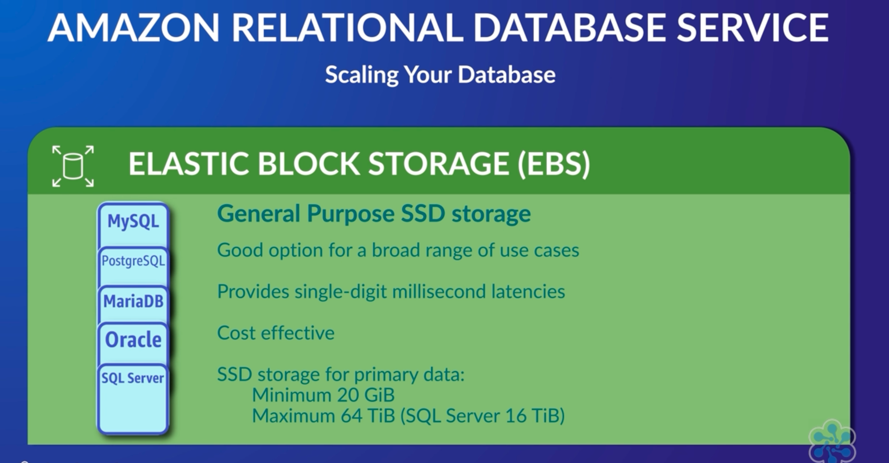

## Amazon Aurora (DB cluster)

* AWS Fastest growing service
* Database engine that's compatible with MySQL and PostgreSQL.
* Aurora doesn't use local storage from the compute instances.
* It has high-performance storage subsystem. 
  * "Shared Cluster Storage Architecture"
* Involves entire clusters of database servers that are synchronized through replication, instead of individual database instances.
* Aurora cluster volume is a virtual database storage volume that spans multiple Availability Zones, with each Availability Zone having a copy of the DB cluster data.
* Aurora is not supported in the region that has lesser than 3 AZ
* Three types of DB instances
  * Primary DB Instance
  * Aurora Replica
    * Connects to the same storage volume as the primary DB instance and supports only read operations.
    * Aurora automatically fails over to an Aurora Replica in case the primary DB instance becomes unavailable.
    * Aurora multi-master clusters, all DB instances have read/write capability.
* Amazon Aurora replicates data _____ ways across multiple availability zones. (six)
  * Aurora is built to be highly available, fault-tolerant, and self-healing, as it replicates your data six ways across multiple availability zones.

## Cluster Storage Volume
1. Quorum and gossip protocol baked within the storage layer to ensure data remains consistent
2. self-healing mechanism for the data

## AWS Aurora HA option
1. EC2 instance of Aurora won't show-up in AWS Management console, since they are managed by AWS
2. 10GB blocks of data stored (Single logical storage cluster volume)
   3. Six-way replicated storage across 3 AZ (but single logical volume)
   4. Data-Copies 2 copies in each AZ
   4. Data-Copies in 3 Regions (overall 3x2 = 6)
5. 30 seconds for failover
5. RDS
   6. Leader and follower replica (no cluster volume)
5. Can manage 4 copies of failed write

## AWS Aurora
1. No patching required
   2. OS and DB is patched by AWS
2. Back-up

## AWS Aurora HA-Options

## AWS RDS Multi-AZ
1. Database replicated in more than one zone (for failover)
2. Synchronous replication between region for multi-az
3. 60-120 seconds for fallback database

## AWS RDS _(instead of own EC2)_

* Scale compute metrics in or out independently
  * processor size, the amount of storage, or the IOPS speed, independently of each other.
* The automatic backups and patching.
* RDS run a synchronous, or asynchronous version of your database, in a different availability zone. (multi AZ support for all RDS)
* Automatic failure detection and recovery

## AWS RDS Instance type
1. General purpose
2. Memory optimized

## Amazon Aurora Connection Management

* Host name and port that we specify point to an intermediate handler called an endpoint.
* Types of Aurora Endpoints
  * Cluster endpoint
    * mydbcluster.cluster-123456789012.us-east-1.rds.amazonaws.com:3306
  * Reader endpoint
    * mydbcluster.cluster-ro-123456789012.us-east-1.rds.amazonaws.com:3306
  * Custom endpoint
    * Define a custom endpoint to connect to instances that use a particular AWS instance class or a particular DB parameter group
    * DB parameter group
      * database engine level parameter (outside database)
      * Same parameter can be applied to multiple database
    * Might need to direct internal users to low-capacity instances for report generation or ad hoc (one-time) querying, and direct production traffic to high-capacity instances.
    * myendpoint.cluster-custom-123456789012.us-east-1.rds.amazonaws.com:3306
    * Monthly report
  * Instance endpoint
    * mydbinstance.123456789012.us-east-1.rds.amazonaws.com:3306
    * fine grained control over which instance you need to service your requests

## Viewing the Endpoints for an Aurora Cluster

* aws rds describe-db-clusters --query '*[].{Endpoint:Endpoint,ReaderEndpoint:ReaderEndpoint,CustomEndpoints:CustomEndpoints}'

## AWS RDS Mysql
* DB Instance type for mysql (without Aurora)
  * General type (Storage type)
  * Memory optimize
  * Provisioned IOPS
* Backtrack is supported for Aurora
  * Explicitly need to enable backtrack during creation
  * Target Backtrack Window

## Amazon Aurora Storage and Reliability

* Distributed and shared storage architecture
* Cluster volume, which is a single, virtual volume that uses solid state drives (SSDs).
  * A cluster volume consists of copies of the data across multiple Availability Zones in a single AWS Region.
*  Aurora doesn't make a new copy of the table data. Instead, the DB instance connects to the shared volume that already contains all your data.
* Daily backups are maintained maximum of 35 days (min 1 day)
* We can do on-demand snapshot
  * Can be stored indefinitely
* How to crash mysql-aurora
  * "Alter System Crash"

## How to run same command multiple times in Shell
1. watch command can do
  

## Aurora Replicas
* Up to 15 Aurora Replicas can be distributed across the Availability Zones that a DB cluster spans within an AWS Region.
* Aurora Replicas work well for read scaling because they are fully dedicated to read operations on your cluster volume.
* Single master and multiple replicas
  * Read replica can be promoted to master when master fails.
* [Multi master and multiple replicas](https://github.com/cloudacademy/aurora-multimaster)
  * Parallel write is possible
  * Maximum of 4 compute instances can be configured as masters in a multi-master cluster
  * Incoming database connections to an Aurora-multi-master cluster are not load balanced by the service
  * Client has to implemented and performed within the client

## Scaling
1. Vertical Scaling
   2. Increase the DBInstance m.large to m2.large
2. Horizontal scaling
   3. Read replica

## Aurora Serverless

* Aurora database product without managing the resources.
* For a cluster, you can set a min and max ACU (Aurora Capacity Units) based on the load and can even go down to 0 to be paused.
  * 2GB - 32GB RAM (1ACU to 16ACU)
* Only billed for storage consumed when the instances are zero.
* Billing is based on resources used on a per-second basis.
* Aurora Serverless - Use Cases
  * Infrequently used applications.
  * Low volume blog site.
  * You only pay for resources as you consume them on a per second basis.
* Single connection endpoint
  * It is for both read/write
* Web Service Data API
  * Aurora serverless databases
* 

## Images
* 
* 
* 
* 

## Reference

* [Amazon Aurora](https://github.com/alozano-77/AWS-SAA-C02-Course#Amazon Aurora)