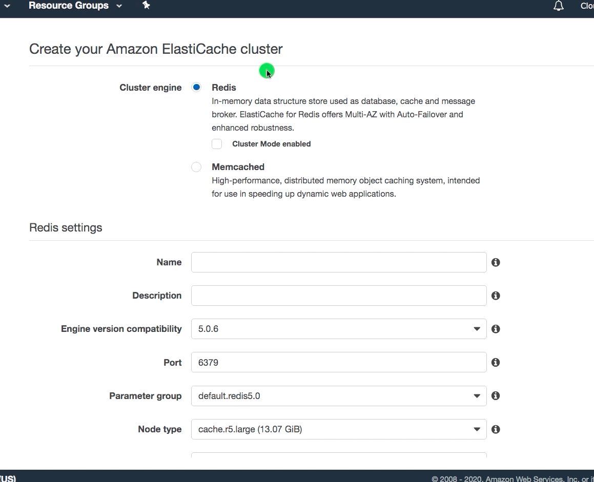
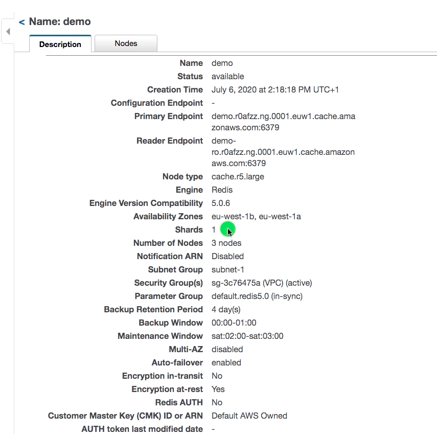

## AWS Elasticache Overview

* What is cache
* What is ElastiCache Service? Why we need them?
* What are ElastiCache features?
* 
* 
## AWS Elasticache

* WebService create,operate and scale in-memory datastore or cache in the cloud
* To make it faster (works similar to L2 cache, for applications)
* Most of the applications reads more than write data
* We can horizontally scale web layer, but we can't do the same for DB layer
  * Cache can reduce the load on the DB layer, cache can horizontally scale
* Managed Service (no patching, update)

## AWS Elasticache - When to use?

* When demand is Sub-millisecond response time
* Requires scaling
* To improve performance
* Compatible with MemCached and Redis
* It is located part of Database (under management console)


## AWS ElasticCache for MemCached
1. when submillisecond latency memcached-compatible
2. in memory key-value store service that can either be used as cache, in addition to a datastore
3. Usecase
   4. Caching
   5. Session store

## AWS ElasticCache for Redis
1. when sub-milli0second latency *data-store* requires for high performance on a huge scale to real-time applications
2. Use-case
   3. Caching
   4. Session store
   5. Chat and Messaging
   6. Gaming Leaderboards
   7. Geospatial
   8. Machine Learning
   9. Queues
1. Redis Cluster Mode (enabled/disabled)
   2. With enabled each cluster can have 90 shards
   3. Cluste-mode-enabled = (Scale out)
4. Components of ElasticCache
   5. Node - Network attached RAM, Fixed size (any EC2 instance can be selected r2/)
      6. Node-type (cache.r5.large)
   6. Shards (Node group) - group of upto 6 ElasticCache nodes
   6. Cluster - 1-90 Redis shards

## Amazon MemoryDB for Redis
1. Fully managed, in-memory, Redis-compatible data store
2. Deployed as a cluster service a dataset that is partitioned into shards
3. Eache shard has a primary node and upto 5 read replica nodes
   4. (can spread across availability zones for high availability)
5. Cluster may have upto 500 nodes
   6. storage upto 100TB
7. TXN logs distributed across availability zones
8. Data tiering allows to move less-frequetly accessed data to disk
8. Supports encryption in transit and at-rest
9. Snapshot for easy backup and restore of your MemoryDB cluster

## AWS Elasicache usecase

```txt
We have a website that provides support information about the range of motorcycles that we sell worldwide. We've sold five million motorcycles since 2010. Our support website usually receives around 100 thousand hits a day, generally from people looking for information about the specifications of our motorcycles and user guides. 
One day, a fault is reported in a hose pipe, commonly used in motorcycle engines. Anyone who has a motorcycle wants to verify that their bike does not use this hose pipe. Luckily, our motorcycles do not use the faulty hose pipe, and we put out a press release stating that fact. 
However, we fear the worst, since last year a similar fault was announced and our website crashed when two million customers checked our website for information about the fault. This time, our website received seven million views, however, the website was able to respond and deliver on those requests, because after the site crashed last year, we implemented Amazon ElastiCache between the web server and the MySQL database, to cache website-based content. 
Now when the web server requests the press release page, the content of that page is delivered out of Amazon ElastiCache, reducing the amount of time it takes the web server to display the press release by removing the need for the web server to request the press release page content from the MySQL database.
```
AWS recommends that you use an ElastiCache Redis (cluster mode disabled) cluster in which situation?
To handle highly read intensive application
* Runs within VPC
* [Memcached vs Redis](https://aws.amazon.com/elasticache/redis-vs-memcached/)
