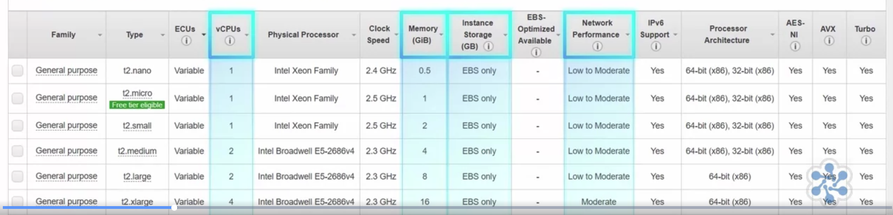

## [AWS Compute](https://aws.amazon.com/products/compute/)

* EC2 (compute cloud)
 * [https://aws.amazon.com/products/compute/](https://aws.amazon.com/products/compute/)
* Beanstalk
* Lambda
* Serverless application model (SAM)
* [Containers](https://aws.amazon.com/containers/)

## AWS Products
* https://aws.amazon.com/products/compute
* https://aws.amazon.com/products/storage
* https://aws.amazon.com/serverless
* https://aws.amazon.com/products/databases
* https://aws.amazon.com/products/developer-tools

## What are all the EC2 components

1. AMI
   1. AWS AMIs are free
   1. We can choose our existing running instance and burn custom AMI
   1. Marketplace also has paid AMI
   1. Community AMI
2. InstanceType
   1. 
   1. [Family types](https://aws.amazon.com/ec2/instance-types/)
3. Instance Purchasing Option
   1. On-Demand
      2. Per second billing - costlier
   1. Reserved Instances
      1. All upfront (High discount)
      1. Partial upfront
      1. No Upfront (low discount)
   1. Scheduled Instances
      1. Charged for schedule even if not used
   1. Spot Instances
      2. Bid for unused EC2
   3. OnDemand capacity reservations
4. Tenancy
   5. Shared Tenancy - H/w shared by multiple customers
   6. Dedicated Instances - H/2 not shared by other customers
   7. Dedicated Hosts
      1. Additional visibility and control on the physical host
      1. License visibility
      1. VM flexibility
      1. Compliance could be driving reasons
5. User Data
   1. yum update -y
   1. commands that will run during the *first boot cycle*
6. Storage Options
   7. Persistent storage (EBS volumes)
      1. EBS connected via AWS network
      1. Can disconnect and maintain the data
      1. Supports encryption, take backup snapshots of all data
   8. Ephemeral Storage (local storage)
      1. Physically attached underlying host
      1. All the saved data on disk is lost when instance is terminated.
      1. If you reboot your data will remain intact
7. Security
   1. SecurityGroup (firewall rules)
      1. Security group name and rule
         1. Type (SSH/SMTP)
         2. Protocol
         3. Port Range
         4. Source (0.0.0.0/0) or CIDR or IP or SecurityGroup
   2. KeyPair
      1. Public Key
         1. Kept by AWS
      1. Private Key
         1. Responsibility of the user
      1. Same keypair can be used for multiple instances
      1We can't create after instance is created (hence we have to download while generating as part of last step)

## Launching Instance

1. Select AMI
2. InstanceType
3. SecurityGroup
4. VPC (Select)
5. Subnet (Select)
6. Shutdown Behavior
   1. Stop
   1. Terminate
9. Configure for optional CloudWatch

## AWS EC2 Autoscalling
1. scale new instances based on
   1. Response time
   1. CPU > 70%
   1. Memory usage
1. We can also scale-back/scale up
   2. scale-in (downsize)
1. Advantages
   2. Automation
   3. Customer satisfaction
   4. Cost reduction

## Autoscaling readings

1. [Using Elastic Load Balancers and EC2 Auto Scaling to Support AWS Workloads](https://cloudacademy.com/blog/elastic-load-balancers-ec2-auto-scaling-to-support-aws-workloads/)
1. [Three Ways to Cut Your EC2 Costs with Hands-on Labs](https://cloudacademy.com/blog/three-ways-to-cut-your-ec2-costs/)
1. [Application Load Balancer vs. Classic Load Balancer](https://cloudacademy.com/blog/application-load-balancer-vs-classic-load-balancer/)
1. [Your First Day on Amazon Web Services: 10 AWS Pitfalls and How to Avoid Them](https://cloudacademy.com/blog/your-first-day-on-aws-10-pitfalls-and-how-to-avoid-them/)
1. [Elastic File System: What You Need to Know](https://cloudacademy.com/blog/elastic-file-system-what-you-need-to-know-about-amazons-new-service/)
