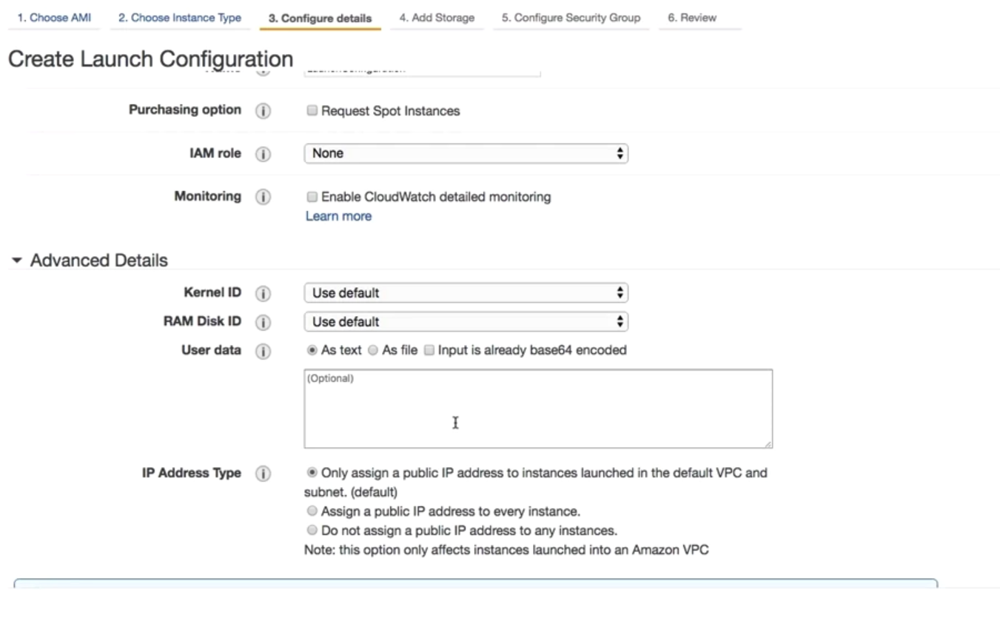
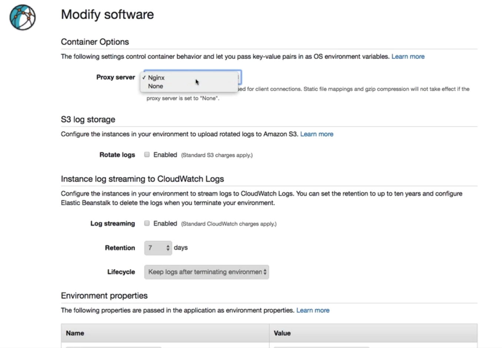
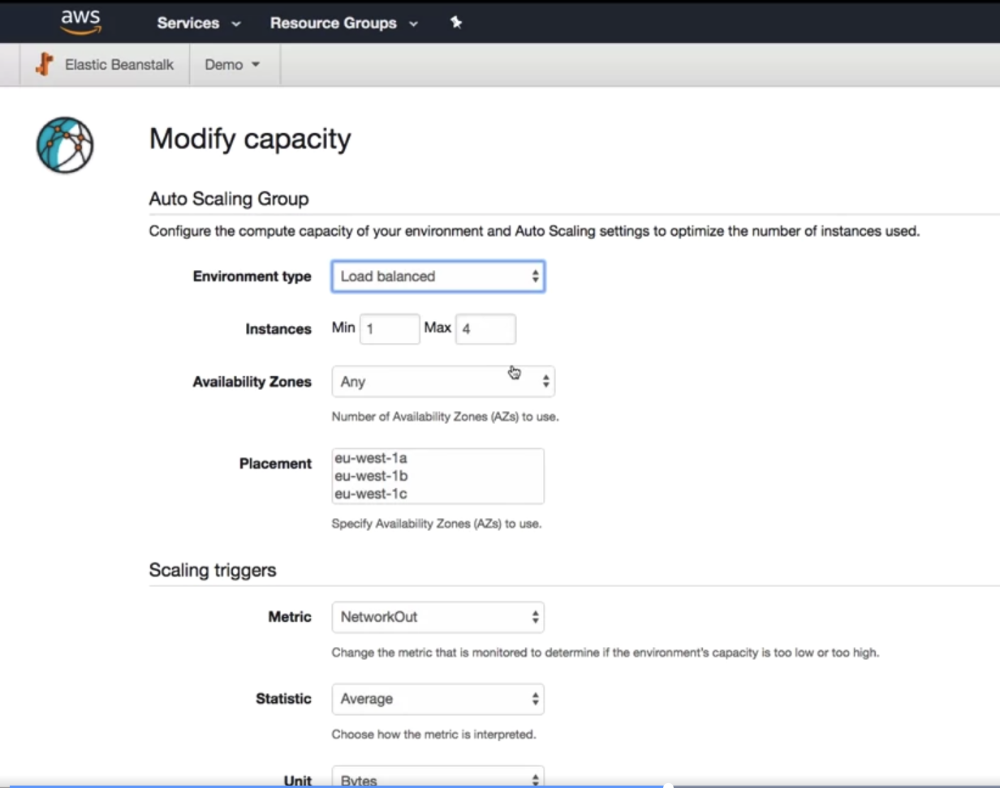

## [AWS Compute](https://aws.amazon.com/products/compute/)

* EC2 (compute cloud)
 * [https://aws.amazon.com/products/compute/](https://aws.amazon.com/products/compute/)
* Beanstalk
* Lambda
* Serverless application model (SAM)
* [Containers](https://aws.amazon.com/containers/)

## AWS Products
* https://aws.amazon.com/products/compute
* https://aws.amazon.com/products/storage
* https://aws.amazon.com/serverless
* https://aws.amazon.com/products/databases
* https://aws.amazon.com/products/developer-tools

## What are all the EC2 components

1. AMI
   1. AWS AMIs are free
   1. We can choose our existing running instance and burn custom AMI
   1. Marketplace also has paid AMI
   1. Community AMI
2. InstanceType
   1. 
   1. [Family types](https://aws.amazon.com/ec2/instance-types/)
3. Instance Purchasing Option
   1. On-Demand
      2. Per second billing - costlier
   1. Reserved Instances
      1. All upfront (High discount)
      1. Partial upfront
      1. No Upfront (low discount)
   1. Scheduled Instances
      1. Charged for schedule even if not used
   1. Spot Instances
      2. Bid for unused EC2
   3. OnDemand capacity reservations
4. Tenancy
   5. Shared Tenancy - H/w shared by multiple customers
   6. Dedicated Instances - H/2 not shared by other customers
   7. Dedicated Hosts
      1. Additional visibility and control on the physical host
      1. License visibility
      1. VM flexibility
      1. Compliance could be driving reasons
5. User Data
   1. yum update -y
   1. commands that will run during the *first boot cycle*
6. Storage Options
   7. Persistent storage (EBS volumes)
      1. EBS connected via AWS network
      1. Can disconnect and maintain the data
      1. Supports encryption, take backup snapshots of all data
   8. Ephemeral Storage (local storage)
      1. Physically attached underlying host
      1. All the saved data on disk is lost when instance is terminated.
      1. If you reboot your data will remain intact
7. Security
   1. SecurityGroup (firewall rules)
      1. Security group name and rule
         1. Type (SSH/SMTP)
         2. Protocol
         3. Port Range
         4. Source (0.0.0.0/0) or CIDR or IP or SecurityGroup
   2. KeyPair
      1. Public Key
         1. Kept by AWS
      1. Private Key
         1. Responsibility of the user
      1. Same keypair can be used for multiple instances
      1We can't create after instance is created (hence we have to download while generating as part of last step)

## Launching Instance

1. Select AMI
2. InstanceType
3. SecurityGroup
   4. We can select SecurityGroup for a given template
4. VPC (Select)
5. Subnet (Select)
   6. We can select multiple subject for a given template
6. Shutdown Behavior
   1. Stop
   1. Terminate
9. Configure for optional CloudWatch

## AWS EC2 Autoscalling
1. scale new instances based on
   1. Response time
   1. CPU > 70%
   1. Memory usage
1. We can also scale-back/scale up
   2. scale-in (downsize)
1. Advantages
   2. Automation
   3. Customer satisfaction
   4. Cost reduction
1. [**Launch configuration vs Launch Template**](https://docs.aws.amazon.com/autoscaling/ec2/userguide/create-launch-template.html)
   2. Iam Profile vs IAM Profile Instance
   
1. 
   2. 
   3. 
   4. 

## AWS Launch Configuration
1. 

## Autoscaling steps

1. From Launch Configuration or Launch Template
2. Can override puchase-option from launch template
3. 
3. 
4. 
4. 
5. 

## Autoscaling policy types

* Manual Scaling
  * Creating scale ahead of any marketing campaign
  * Ideal for planned events
* Dynamic Scaling
  * Step scaling
    * Could be based on overall CPU usage
    * Cooldown policy - adding new node would take few minutes... policy should consider that
    * Trigger points using CloudWatch Alarm
      * There could be multiple levels of alarm (60% 75% and 95% alarms)
      * 
    * Scale up quickly (it takes time to spin-up machines)
    * Scale down slowly (it is nearly instantaneous to tear down)
  * Target Tracking
    * We don't need to setup alarms (it is built-in, automatically created, don't delete it)
    * Auto-alarms are removed when target scaling policy is created
* Predictive Scaling
  * CloudWatch metrics (from archived data) used for ML predictive scaling
  * Can run only forecast mode (without scaling)
  * For start of every hour
* Scheduled Scaling
  * Batch process (when spot instances are lower)
  * Time based trigger (preferably during less workload times)
* Yaml/json
  * stored with .config extension
  * .ebextensions folder of the source code
* 

## AWS Beanstalk

1. [Amazon EC2 Container Service and Elastic Beanstalk: Docker on AWS](https://cloudacademy.com/blog/amazon-ec2-container-service-docker-aws/)
2. [Deployment Orchestration with AWS Elastic Beanstalk](https://cloudacademy.com/blog/deployment-orchestration-with-aws-elastic-beanstalk/)
3. [How to Deploy Docker Containers on AWS Elastic Beanstalk Applications](https://cloudacademy.com/blog/how-to-deploy-docker-containers-on-aws-elastic-beanstalk/)

## AWS Beanstalk notes

* [Step by step notes](https://docs.aws.amazon.com/elasticbeanstalk/latest/dg/GettingStarted.html)
* Cloud web application without explicitly using cloud API
  * Whether you’ve written your app in Python, Ruby, Java, Node.js, Go, or PHP
  * Elastic Beanstalk only requires you to set the appropriate platform (including an operating system and platform version) from a pull-down menu
  * Upload your application, and run it. 
  * AWS will take care of all the details 
    * Compute, networking, autoscaling, load balancing, and monitoring – invisibly.
* Bealstalk core components
  * Applications
  * Application Version
  * Configuration Template
  * Environment Configuration
  * Environment Template
  * Environment
  * Platform

## ElasticBeanStalk Environment Tiers (Two tiers)

* HTTP Requests - WebServer Environment
  * Webserver Tier
    * Route53
      * Uses CName record
      * Used by ELB
    * ELB
    * AutoScaling
    * EC2 instance
    * Security Groups
    * Host Manager
* SQS Queue - Worker Environment
  * Auto Scaling
  * IAM Service Role
  * EC2 instances
  * Daemon (similar to Host manager)

## AWS Beanstalk - Deployment Options

* All at once
  * Default choice
* Rolling
  * Minimize the amount of disruption that is caused
  * Two different version at the same time
  * Gradually rolled
* Rolling with additional batch
  * Similar to rolling
  * Additional new batch of instances are started
  * Application availability is maintained
* Immutable
  * Create entirely new instanced
  * Double in size (in-between)

## AWS Beanstalk - Steps
* 
* 
* 
* 
* 
* 
* 
* 
  
## AWS Beanstalk - Monitoring

* Two different level
  * Basic Health Reporting
    * 5 Minute interval
    * 4 color update
    * 10 sec autoscaling for ELB interval
  * Two status check
    * System status check (h/w check)
    * Instance status check (health monitoring urls)
      * Failure reasons
        * Incorrect network configurations
        * Corrupt file systems
        * Exhausted memory
        * Incompatible kernel
  * Advanced Health Reporting
    * 7 color update
      * degraded/pending/severe/suspended/warning/ok
    * Health agent is installed and monitors
      * CloudWatch collect collects the data
    * CloudWatch is integrated with additional cost
* 
* 
* 
* 

1. [Using Elastic Load Balancers and EC2 Auto Scaling to Support AWS Workloads](https://cloudacademy.com/blog/elastic-load-balancers-ec2-auto-scaling-to-support-aws-workloads/)
1. [Three Ways to Cut Your EC2 Costs with Hands-on Labs](https://cloudacademy.com/blog/three-ways-to-cut-your-ec2-costs/)
1. [Application Load Balancer vs. Classic Load Balancer](https://cloudacademy.com/blog/application-load-balancer-vs-classic-load-balancer/)
1. [Your First Day on Amazon Web Services: 10 AWS Pitfalls and How to Avoid Them](https://cloudacademy.com/blog/your-first-day-on-aws-10-pitfalls-and-how-to-avoid-them/)
1. [Elastic File System: What You Need to Know](https://cloudacademy.com/blog/elastic-file-system-what-you-need-to-know-about-amazons-new-service/)

