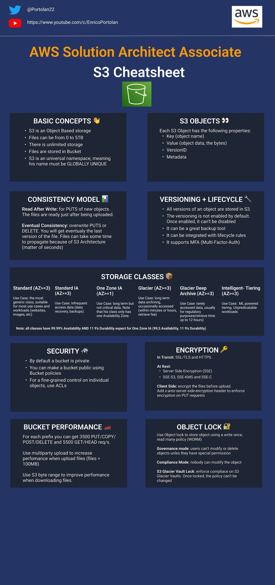

## AWS S3
2. 

## What is the cardinality relationship between EC2 and EBS Volume
1. An EBS volume can be attached to only one EC2 instance in the same AZ
1. Multiple EBS volume can be attached to one EC2 instance in the same AZ

## What are storage types
1. Block Storage, File storage, Object Storage

## Where does EBS volumes are stored
1. S3, Snapshots are incremental

## EBS Volumes
* They are only in one AZ
* EBS volume types are - SSD backed and HDD backed
* SSD Types - 3000 IOPS,  3 IO OPS upto 10000, 128MB upto 170GB
* Provisioned 4-16TB
* Can be encrypted (at rest and in-transit)
* Can be elastic
* Can restore volume on larger volume to increase the file-system size
* GP2, IO1, ST1, SC1
* Not suitable for temporary or multi-instance storage (S3 is suitable)
* Amazon EBS encryption 
  * Uses AWS Key Management Service (AWS KMS) customer master keys when creating encrypted volumes 
  * Uses above for any snapshots created from your encrypted volumes.
* SSD-backed storage is better suited for scenarios that work with smaller blocks, such as databases using transactional workloads, or often as boot volumes for your EC2 instances. 
* HDD-backed volumes are designed for better workloads that require a higher rate of throughput, such as processing big data and logging information. 
  * So, essentially, they are designed for working with larger blocks of data.

## S3 
* There are 5 storage classes, Standard, OneZone-IA, Standard IA, Intelligent Tiering, Glacier, Glacier-Deep-Archive
* Amazon Glacier is an extremely low-cost storage service that provides secure and durable storage for data archiving and backup. To keep costs low, Amazon Glacier is optimized for data that is infrequently accessed and for which retrieval times of several hours are suitable. The standard retrieval option, which is the default option, takes 3-5 hours to complete. The other options are expedited, which downloads a small amount of data (250 MB maximum) in 5 minutes, and bulk, which downloads large amounts of data (petabytes) in 5-12 hours.
* Standard - Properties
   * Versioning
   * Server access logging
   * Static website hosting
   * Object-level logging 
   * Default Encryption
* Advanced - Properties
  * Object lock
  * Tags
  * Transfer acceleration
  * Events
  * Requester Pays
* Versioning - Not enabled by default
  * Once we delete, object would have deleted marker on it, with GET operation ends up with 404. But older version exist if we have enabled versioning.
* Versioning - suspended
* Server access logging
  * Default disabled (Enable by specifying Target bucket and Target prefix)
  * Requires LOG DELIVERY GROUP write access for the target bucket ACL to log
  * Management console adds LOG DELIVERY GROUP by default when logging is enabled.
  * Access log will only be delivered - SSE-S3 - should be enabled and KMS is not supported
* Static website hosting
  * Region specific end-point - HTTP only and requestor can't pay
  * Should add index document and error document
  * Redirect access to bucket
  * By default, blocked to public
  * Should we need to add policy to grant access for public
  * Policy  to access S3 bucket
      ```json
      {
          "Version": "2012-10-17",
          "Statement": [
              {
                  "Sid": "PublicReadGetObject",
                  "Effect": "Allow",
                  "Principal": "*",
                  "Action": [
                      "s3:GetObject"
                  ],
                  "Resource": [
                      "arn:aws:s3:::example.com/*"
                  ]
              }
          ]
      }
      ```
* Object logging - Related to CloudTrail
  * GetObject/DeleteObject/PutObject
  * Can select events that needs to be logged with timestamp
  * We can configure existing trail to log S3 access logging
* Encryption
  * None, AES-256, AWS-KMS
  * SSE-S3 - Server side encryption with S3 managed keys
  * Other encryption
    * SSE-C
    * CSE-KMS
    * CSE-C (customer manged keys)
* Object lock
  * WORM - Write once read many
  * Object lock without version is not possible
  * We can't disable once we enabled
  * RetentionMode and Governance Mode
  * Retention Period can be enabled
  * Compliance mode would force retention period
  * Compliance mode cannot be disabled by any user
  * Governance mode can be disabled that have specific IAM permission
  * Legal hold - we can't delete even after retention period
* Tags
  * Environment - Production/UAT/DEV
  * S3 Cost Allocation tags
* Transfer Acceleration
  * Amazon CloudFront - is used to transfer acceleration
  * Additional Cost
  * Should be domain accessible without DOT in bucket name
  * Does not support Get/Put/Delete, 
  * Cross region copies using Put Object Copy
* Events
  * Selected events with Prefix or Suffix
  * SendTo components
    * Lambda, SNS or SQA
* Requester Pays
  * x-amz-requester-pays header is used

## Instance storage

* Temporary and ephemeral
  * Reboot retain data, but stopped and terminated would lose data
* It is in the price of instance

## Amazon Glacier
* Amazon Glacier is an extremely low-cost storage service that provides secure and durable storage for data archiving and backup. 
  * To keep costs low, Amazon Glacier is optimized for data that is infrequently accessed and for which retrieval times of several hours are suitable. 
  * The standard retrieval option, which is the default option, takes 3-5 hours to complete. 
  * The other options are expedited, which downloads a small amount of data (250 MB maximum) in 5 minutes, and bulk, which downloads large amounts of data (petabytes) in 5-12 hours.
* When using Amazon Glacier Flexible Retrieval's expedited retrieval option, Amazon Glacier takes 1-5 minutes to retrieve data.

## S3 - URL - Virtual-hosted–style and path-style URLs
```bash
  https://my-bucket.s3.us-west-2.amazonaws.com # Virtual hosted style
  https://my-bucket.s3-us-west-2.amazonaws.com # Old style some legacy region supports (deprecated)
  https://s3.Region.amazonaws.com/bucket-name/key name # Path style
```
* Buckets created after September 30, 2020, will support only virtual hosted-style requests. 
* Path-style requests will continue to be supported for buckets created on or before this date.

## S3 - AWS Route53

* To route domain traffic to an S3 bucket, use Amazon Route 53 to create an alias record that points to your bucket. An alias record is a Route 53 extension to DNS. 
  * Alias record is similar to a CNAME record
  * An alias record can be created for both for the root domain, such as example.com, and for subdomains, such as www.example.com.
  * CNAME records can be created only for subdomains.

## S3 encryption mechanism to secure data

* [AWS S3 Encryption Infographic](https://awsinfographics.s3.amazonaws.com/S3_Encryption_Infographic.png)
* S3 Encryption mechanism
* Server side encrypted
  * SSE-S3 (S3 manged keys)
    * SE-S3 manages the keys for you; similarly, using SSE -S3 makes the encryption process invisible to the end user. 
    * Thus limiting your ability to understand or mitigate the encryption key issue.
  * SSE-KMS (KMS manged keys)
    * Choosing server-side encryption with Key Management Service (KMS) because it allows you to define policies that define how keys are used.
    * Able to disable, rotate, and apply access controls to the KMS key, and audit against their usage using AWS Cloud Trail.
  * SSE-C  (Customer provided keys)
* Client side encrypted
  * CSE-KMS (KMS managed)
  * CSE-C (customer provided, and client side encrypt)

## SSE S3 headers
*    "s3:x-amz-server-side-encryption": "aws:kms"
*    "s3:x-amz-server-side-encryption-aws-kms-key-id" : "arn:aws:kms:us-west-2:568157667383:key/86b02606-7d41-4a20-a694-d2b4d93cb522"

* [New – Amazon S3 Server Side Encryption for Data at Rest](https://aws.amazon.com/blogs/aws/new-amazon-s3-server-side-encryption/)
* [AWS Key Management Service Cryptographic Details
](https://d0.awsstatic.com/whitepapers/KMS-Cryptographic-Details.pdf)

## References
* [how-to-encrypt-an-ebs-volume-the-new-amazon-ebs-encryption](https://cloudacademy.com/blog/how-to-encrypt-an-ebs-volume-the-new-amazon-ebs-encryption/)
* Offers very high speed IO