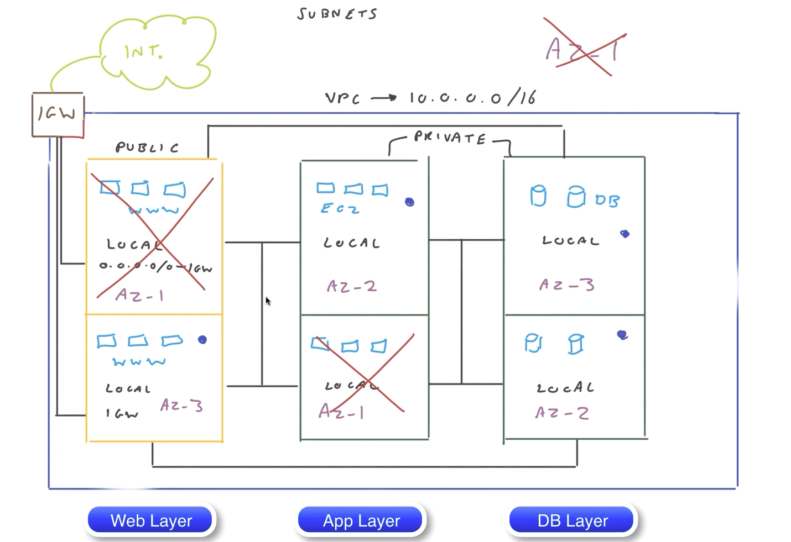
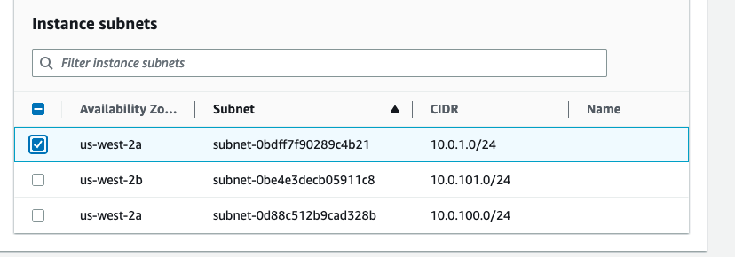
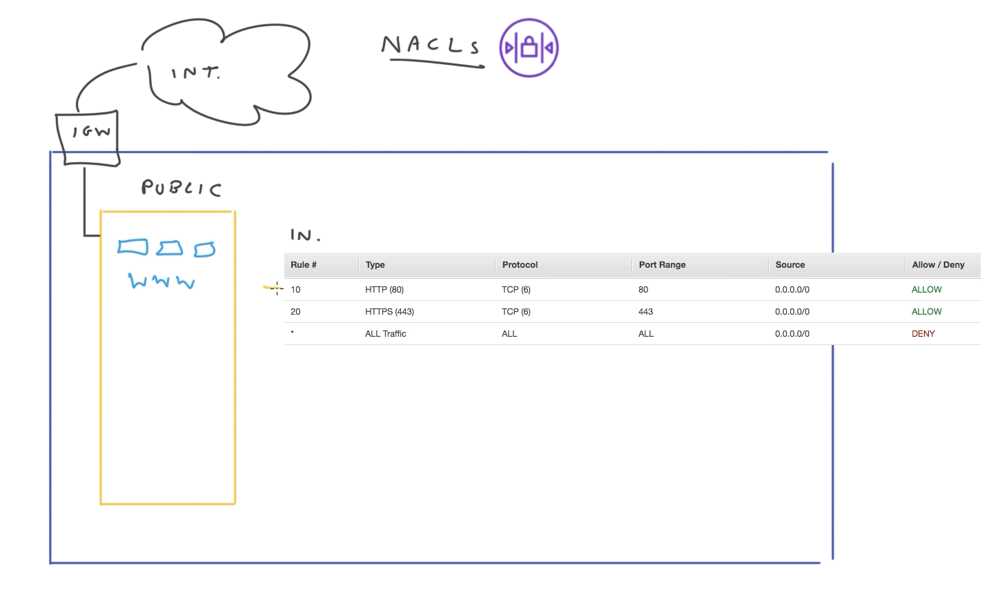
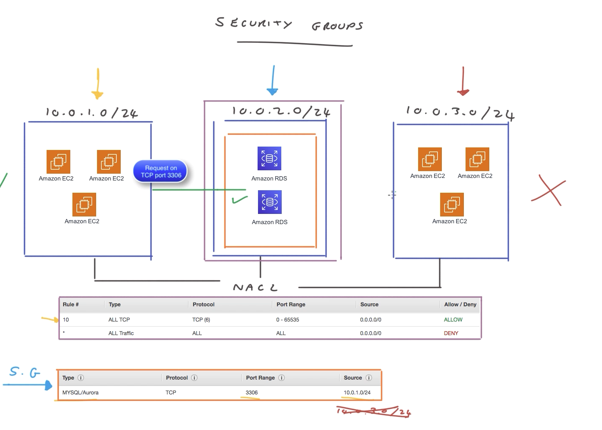

# Virtual Private Clouds

## Components of VPC
1. Subnets
1. Route Tables
1. NAC - Network Access List
1. Nat instances and Nat Gateways
1. Bastion Hosts
1. VPN and Direct Connect
1. VPC Peering
1. VPC Transit Gateway
1. IGW - Internet gateways and Load Balancers

## VPC
1. Each account is allowed to create 5 VPC per region
1. VPC = Name + CIDR block (IP-Address range)
1. [VPC Quotas](https://docs.aws.amazon.com/vpc/latest/userguide/amazon-vpc-limits.html)

## What is netmask?
* It is primarily used in conjunction with IP address classes to determine the network address range and the number of hosts that can be accommodated within a network.
* For example, consider the IP address 192.168.0.100 with a netmask 255.255.255.0.
* The netmask 255.255.255.0 in binary is 11111111.11111111.11111111.00000000.
* In this case, the leftmost 24 bits (or 3 octets) represent the network portion, and the rightmost 8 bits (or 1 octet) represent the host portion.
* By performing a bitwise AND operation between an IP address and its corresponding netmask, you can obtain the network address.
* In the example above, the network address would be 192.168.0.0.
* The remaining bits in the IP address (in this case, the last octet 100) represent the host portion.

### Subnets and CIDR block

* It is segmented partition within VPC
* We can create public-subnet and private subnet
  * public subnet and private subnet are same, just  IGW is attached to public subnet.
  * public subnet = private-subnet + IGW + Route-Table
* Each subnet is ip-address block using CIDR
* Every subnet has a route-table
* For VPC, CIDR can range from */16 to */28
   * Example: 10.0.0.0/16
   * Example: 10.0.1.0/24 - 10.0.2.0/24
* Isolated VPC can access internet by connecting with IGW
* VPN requires associated route table to access internet
* Route-table
  * We can't attach more than one route table to a subnet
     * Same route table can be attached to multiple subnets
  * Local Route - Undeletable default route helps to subnets talk to other subnets within VPC
     * Example Local Route - Destination: 10.0.0.16/16 -> Target: Local (Example default route)
* Route table entry in IGW
  * 0.0.0.0/0 -> igw-212823ab5g (Any host within VPC can contact IGW)
* Private subnet
    * If a subnet doesn't have a route to the Internet gateway, the subnet is known as a private subnet.
    * The private subnet routes internet traffic through the NAT instance.
* 

### Subnets, Region and Resiliency

* For every subnet in AZ, it is better to have replica one in another AZ
* Web/App/DB Layer - Each can be in different sub-net
* 


## CIDR-Limitation on VPC (except 5 IP address of each subnet)
* First four IP address and last ip-address within subnet can't be used
* 10.0.1.0/24 - is a subnet
  * 10.0.1.0   -> Network IP address any subnet (Application can't use)
  * 10.0.1.1   -> AWS Routing reserved (Application can't use)
  * 10.0.1.2   -> AWS DNS reserved (Application can't use)
  * 10.0.1.3   -> AWS Future (Application can't use)
  * 10.0.1.4 -to-  10.0.1.254  -> No restrictions
  * 10.0.1.255 -> Broadcast IP address on any subnet (Application can't use)
  * 251 IP addresses out of 256 is accessible for our VPC
    

## 0.0.0.0/0 -> Every IP that is not explicitly configured in route table.

## Largest possible VPC network
* Deploying the largest VPC possible results in over 65,000 IP addresses.
### 10.x.x.x address space
* We can use over 16,000,000 IP addresses


## NACL

* NACL works at network level (not instance level)
* NACL (pronounced like nuckle) are stateless
    *  Any response traffic generated from a request will have to be explicitly allowed and configured in either the inbound or the outbound ruleset, depending on where the response is coming from.
    * In SecurityGroup, if we allow request traffic, response traffic is enabled (can't accept one-way)
* by default, NACL will allow all traffic, both inbound and outbound, so it's not very secure
* Inbound Rules  + Outbound Rules
    * Rule-#, Type,	Protocol,	Port range,	Source,	Allow/Deny
    * PPTRASI (Self made abbreviation - Port,Protocol+Type+Allow-Deny,Source and ID)
    * Rule-ID with "*" is considered fall back rule
* A NACL can be applied to a number of subnets (like route tables)
* A single NACL can be associated to one subnet
* NACL evaluate the rules starting with the lowest numbered rule, to determine whether traffic is allowed in or out of any subnet associated with the network ACL.
    * The highest number that you can use for a rule is 32766.
    * It is recommended to creating rules in increments (for example, increments of 10 or 100) so that you can insert new rules where you need to later on.
* [NACL document](https://docs.aws.amazon.com/vpc/latest/userguide/vpc-network-acls.html)
* When you add or remove rules from a network ACL, the changes are automatically applied to the subnets it is associated with.
* 

## Security Group

* No rule number, All the rules are evaluated before decisions are made (unlike NACL)
  * Works at instance level (not at network level)
* We can specify allow rules, but not deny rules. Default everything is deny!
* Security-Group = Type/Protocol/Port-Range/Source (MySQL|HTTP/TCP/3306/10.0.1.0`/`24)
* By default, a security group includes an outbound rule that allows all outbound traffic. You can remove the rule and add outbound rules that allow specific outbound traffic only.
    * If your security group has no outbound rules, no outbound traffic originating from your instance is allowed.
* Note that NACLs may take a bit longer to propagate, as opposed to security groups, which take effect almost immediately (1-2 seconds).
* 

## VPC - Nat Gateway

* Why NAT Gateway
  * If private subnet requires OS/security update, how to download patch from internet
  * Nat gateway accepts private-subnet initiated connection
  * Nat gateway rejects internet initiated connection into private subnet
* Nat gateway should sit in public gateway (not in private)
* It is managed by AWS, default, it would create fail-over, we can suppress
* Private subnet should have an entry 0.0.0.0/0 ---> Nat Gateway to gain access to internet
   * 0.0.0.0/0 -> nat.0fabcdef678ghk
* Nat-gateway should be configured for resilient fallback VPC as well
* NAT instance is in the public subnet
   * It cannot be reached from the internet. 
   * It has an inbound rule that only grants instances from the private security group (private instances) access. 

### Bastion Hosts
* Why we need Bastion hosts
  * EC2 instance in private subnet might need to be accessed from internet (internet initiated)
  * Remote engineer need to work
* Bastion Host
  * It acts as Jump server
  * Should be in public subnet
  * Should be very secure/hardened/Robust
  * Hackers attack them to gain access into private subnet
* Security group configuration
  * We need two security group
  * Security group to accepts connection to bastion hosts (Example: allow SSH incoming)
  * Security group in private subnet to accepts connection from bastion hosts (Example: allow SSH incoming connection from bastion host)
  * Bastion hosts receives connection via IGW
* Checklist
  * Don't store EC2 or other instances private key in bastion hosts
  * SSH Agent forwarding should setup on trust client machine who wants to gain access  

### VPN & Direct connect to VPC

* How to access VPC private subnet from Data Center using VPN
* VPN - 192.168.0.0/16 - Address space
* VPC - 10.0.0.0/16 - Address space
* VGW - Virtual Gateway should be attached to VPC
   * VGW - should configure about CGW details such as ip-address of customer gw
   * What type of routing table to be used @ CGW dynamic/static should be configured in VGW
* CGW - Customer gateway should be attached to DataCenter (Hw/SW)
* VPN Tunnel should be created between CGW & VGW
  * CGW alone can initiate connection to VGW (not the other way)
* By default, VPN tunnel will drop connection if it is idle for 10 seconds or more, so monitoring should be in place using customer ping
* Routing table associated with private subnet should have entry
  * 192.168.0.0/16 -> vpw-02abcndGis3ds72k2 (to route data to DataCenter from VPC)
* Route Propagation supported for customer gateway that also support BGP
  * Static route table within VPC is not required if VPN has CGW that supports BGP (border gateway protocol)
  * There could be multiple CGW with VPC
* Security group should allow only certain protocol from CGW to Private subnet

### Direct Connect

* Direct Connect is private connection and also get speeds from 1 through to 10 gigabits per second.
* AWS gas regional telecom Vendor support to add router for partner (client) and AWS router.
* All client data traffic would be routed via private connection within Vendor infrastructure
* Both AWS Public and Private VPN network is accessible using Direct Connect
* Direct Connect =  Customer data center  + Direct Connect location ( Customer Router + AWS router) +  AWS infrastructure (specific region)


### VPC peering

* A VPC peering connection is a networking connection between two VPCs that enables you to route traffic between them privately
* Instances in any aws VPC can communicate with each other as if they are within the same network.
* The owner of the requester VPC sends a request to the owner of the accepted VPC to create the VPC peering connection. The acceptor VPC can be owned by you, or another AWS account
* VPC peering doesn't work transitively (it is 1-1)
  * (If VPC-A talks to VPC-B, and VPC-B talks to VPC-C, VPC-A can't talk to VPC-C)
* If two VPC has CIDR overlap, they can't establish VPC-Peering
* Routing table between two VPC (10.0.0.0/16 and 172.31.0.0/16)
  * Routing table at VPC1
    * 10.0.0.0/16 -> local
    * 172.31.0.0/16 -> pcx.0fabcdef678ghk
  * Routing table at VPC2
    * 172.31.0.0/16 -> local
    * 10.0.0.0/16 -> pcx.9823fig122xA83
* Security group should allow for other VPC

### AWS Transit Gateway
* A transit gateway is a network transit hub that can be used to interconnect VPC and on-premises networks.
* It is alternative to VPN Peering
* It reduces number of connection (using hub and spoke model)
* All routings are centrally managed
* Transit Gateway goes through this central hub, it allows you to centralize all your monitoring as well for your network traffic and connectivity all through the one dashboard
* Core concepts
  * Attachment  - Attach new VPC to VPN

  
### AWS VPC Lab (604274498499/student/Ca1_IhPhfoCK/172.31.0.0/16)
1. Creating a VPC subnet
1. Creating a VPC Internet Gateway
1. Connecting the Internet Gateway to the VPC Route Table
1. Creating an EC2 instance
1. Allocating and Associating an Elastic IP

#### AWS Lab-1
1. Create VPC with 10.0.0.0/16
  1. Block size always should be between /16 and /28
1. VPC = name + cidr-block (10.0.0.0/16) + tenancy (default/dedicated)
    1. DHCP Options set + Main route table + Main Network ACL (default it creates)
    1. DHCP Options set enables DNS for instances that need to communicate over the VPC's Internet gateway
1. VPC ID - vpc-09598320b1f03592a
1. To create subnet (Name-tag+VPC+AZ+VPC CIDRs)
  1. Choose subnet with lesser netmask for the VPC subnet - Subnet ID subnet-06b1516d2cab54272
  1. We can create maximum of 5 subnet within a VPC
1. Internet Gateway - Internet gateway ID - igw-0d060a75a8b2a2a9e
1. To configure ping to instance, configure security group
  1. All ICMP - IPv4	ICMP	All	0.0.0.0/0	igw_to_instance
1. There is a route table for every VPC, that should be used to add routes  
  
#### AWS Lab-2
1. Create public subnet, a private subnet, and a network address translation (NAT) instance in the public subnet. 
1. Create public subnet with Bation host NAT to connect to private instance
1. Actual steps
    1. Create VPC - cloudacademy-labs with CIDR block - 10.0.0.0/16  (vpc-032ec65cd5ad76f2c)
    1. Create igw with name labs-gw
      1. Attach this IGW with the VPC - vpc-032ec65cd5ad76f2c
    1. Create Public subnet's IPv4 CIDR with name Public-A: - - 10.0.20.0/24 
      1. Create new route table named: PublicRouteTable  and attach it to Public-A subnet (PublicRouteTable)
      1. Route all address not belong to 10.0.0.0/16 to IGW
      1. Create Bastion host (in public VPC) (name: Bastion)
        1. A bastion host is typically a host that sits inside your public subnet for the purposes of SSH (and/or RDP) access (Jump server)
        1. Upon creation - assign public-ip and add the instance part of public subnet
        1. In security group allow SSH connection from required IP address (find.MyIP)
    1. Create Private subnet's IPv4 CIDR with name Public-A: - 10.0.10.0/24 (subnet-0af2d53860d38dd8e)
        1. PrivateRouteTable should be created with IGW (IGW only stop gap, we should remove it)
        1. PrivateRouteTable should allow route to 0.0.0.0/0 via IGW and associate this route table to Private Subnet
    1. Create Private-NACL and attach to Private-Subnet
        1. Add Inbound Rule
            1. Allow SSH from 10.0.20.0/24
            1. Allow TCP port-range from 1024-65535 from 0.0.0.0/0
        1. Add Outbound Rule
            1. Rule-100 : Allow HTTP to 0.0.0.0/0
            1. Rule-200 : Allow HTTPS to 0.0.0.0/0
            1. Rule-300 : Allow TCP Port range 32768-61000 to 10.0.20.0/24
    1. Launch Private EC2 instance in private subnet
        1. Select private subnet and disable public-ip
        1. Configure SecurityGroup (named SG-Provate)
            1. Allow TCP SSH Input from SG-Bastion (SSH only from public subnet of our own VPC)
    1. Open SG-bastion security group (SG created during Bastion)
      1. Allow Destination SSH to SG-Private
    1. Use agent forwarding connect to Public instance
        1. From public instance connect to private instance
        1. sudo yum udpate
    1. Create NAT instance to provide internet for private instances
        1. Choose public subnet
        1. Public-Ip should be enabled
        1. Configure SG-NAT security group
            1. Type of All Traffic and Source of SG-Private (allow all traffic from any instance using your private security group) 
            1. Allow - SSH TCP 22 My IP
        1. Select the NAT instance, then click Actions > Networking > Change Source/Dest. Check. Verify that the attribute is disabled: 
    1. PrivateRoute Table should be updated
        1. Alllow 0.0.0.0/0 using above NAT instances created.


### How to confirm is SSH forwarding was used
```bash
[ec2-user@ip-10-0-20-129 ~]$ env | grep SSH_AUTH_SOCK
SSH_AUTH_SOCK=/tmp/ssh-rfEo0aushe/agent.3598
```

ssh ec2-user@10.0.10.177

## Errors
* No supported authentication methods available (server sent: public-key, gssapi-keyex, gssapi-with-mic)
  1. You may be using wrong user-id, ec2_user instead ec2-user caused me.

sg-02a0d700a289d3bc9	SG-Private
sg-073ccdd96554911fc	SG-bastion
ec2_user@W34.216.151.145


1) Public-VPC - VPC ID-vpc-01691915afc11f067 - 10.0.0.0/19
1.1)  PublicSubnet - Subnet ID/subnet-069b5b1d926b1a3f1 - 10.0.128.0/24
2) Private-VPC - VPC vpc-0d78ffac9dd928baa - 10.0.0.0/19
2.1)  PrivateSubnet - Subnet ID/subnet-0e2a7d97838e62659 - 10.0.0.0/24


## [References](https://aws-quickstart.s3.amazonaws.com/quickstart-linux-bastion/doc/linux-bastion-hosts-on-the-aws-cloud.pdf)
## [Public/Private Subnet security](https://cloudacademy.com/lab/securing-your-vpc-using-public-and-private-subnets-with-network-acl/)