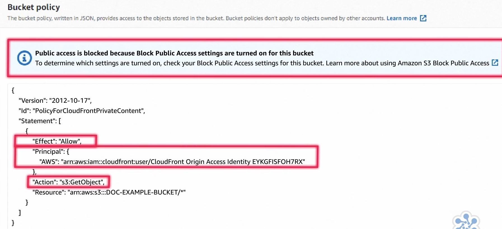

## CDN and DNS

* AWS route 53 - DNS service
  * Hosted Zones
  * Domain Types
  * Record Types
  * Routing policies
* AWS CloudFront - CDN Network

## AWS route 53
1. Domain Name registration
2. DNS Management
3. Traffic Management
   4. Routing Policies
   5. Traffic Flow
   6. Application Recovery controller
   7. Route 53 Resolver
   8. Route 53 Resolver DNS Firewall
4. Using Edge Locations

## AWS route 53 - DNS service

* DNS Service
* Woks inside and outside the AWS
* secure and reliable routing of requests
* Hierarchical distributed naming system
* Phonebook of the internet
    * google.com === 172.217.194.113
* TLD
    * Generic Top level domain
    * Domain name could end with (.watch, .clothing)
* GD
    * Geographic Domains (.au, .uk)

## AWS route 53 - Hosted Zone (collection of records)

* Information about how to route a domain xyz.com
  * Collection of resource record sets hosted by route 53
* Records
  * Name Server Records
  * SOA - Start of Authority Records 
* Public hosted zone - route traffic in internet
* Private hosted zone - route traffic within VPC
  * We can use any domain we wish

## AWS route 53 - record types

* A   - IPV4
  * Hostname to IPV4-Address record
* AAAA - IPV6
* MX - names of our mail server
  * Find identify email servers for a given domain
* TXT
  * Used to provide information in text format to system outside of your domain
* CNAME - Used as one name as alias for another
* CAA
  * Canonical name record
  * Used to maps a hostname to another hostname
* Alias
  * Alias record type unique to route-53
  * Maps custom hostname in your domain to an AWS resource
  * Example Alias to - CloundFront/S3/ELB
    * Naked domain - example.com, cloudacademy.com (domain without www)
    * APEX record to Alias Record
* NPATR
* NS - Name server to hosted zones
* PTR - map IP to domain name
* SOA
* SPF - No longer recommended, identify of the sender email messages
* SRV

## AWS route 53 - Health Checks
1. EndPoint health check every 30 seconds from route-53
   2. We can override to every 10 seconds
2. HealthCheck can be configured for other healthcheck
3. Can monitor CloudWatch Alarm
   4. (Ok, Alarm, InSufficient)
5. Check the word within 5120 byte of http response (to consider valid and health-check)

## AWS route 53 - routing policy

* Simple
  * If multiple A record, randomly choose one of the IP
* Failover
  * Primary resource to secondary resource upon health check failure
* Geo-location
  * Continent, country or state in country
  * When overlap, it would choose smallest (Continent+Country matches, chooses country)
  * Restrict access to only few country
* Geo-proximity
  * Policy based on location + users
  * This is traffic policy
  * Only available if and only if we use traffic flow
  * Uses latitude and longitude
  * Bias (-99 to 99) (Negative less traffic, +Ve more traffic)
* Latency
  * Chooses lowest latency resources
  * May not be closest
* Multi-value answer
  * DNS request upto 8 records, and randomly picked
* Weighted
  * Weight of the individual resource record divide by the sum of the total value in resource record
  * 0 weight never return
  * Each record will be returned based on its weight compared to total weight of all the record
* Abbreviation - SFGGLMW

## AWS route 53 - Traffic flow
1. When we have group of same resources
2. Traffic flow
   1. Visual Editor
   1. Policy version
   1. Policy records
2. 

## AWS route 53 - Route Resolver
1. Data Center to AWS (DX or VPN)
2. Inbound Endpoint
3. Outbound Endpoint (forwarding rules)
4. 
5. AWS Route-53 DNS Firewall
   6. RuleGroup

## AWS route 53 - Recovery COntroller
1. 

## AWS CloudFront - CDN

* CloudFront is AWS's fault-tolerant and globally scalable content delivery network service.
* Speeds up distribution of your static and dynamic content through its worldwide network of edge locations.
* Data is cached, after a set period, this cached data will expire and so AWS CloudFront doesn't provide durability of your data.

## AWS CloudFront Distribution

* Web Distribution
  * Static and dynamic content (html, image, javascript)
  * MediaFiles using HTTP/HTTPS
  * ADD/Update/Delete/Submit data from web-forms
  * Live-streaming to stream an event real time
* RTMP Distribution
  * Streaming distribution using Adobe Flash Media Service RTMP protocol
  * RTMP doesn't require all media to be downloaded to view
  * It should be served from S3, can't be served from webserver

## AWS CloudFront Distribution (for a domain) parameters
1. Select domain
2. Origin domain
3. Protocol
   4. HTTP/HTTPS
   5. Port
3. Origin Path
4. Origin Name
5. Add Header
6. Default Cache Behaviour
7. Pricing Class
8. AWS WAF web ACL
9. Standard Logging
10. IPV6(on/off)

## 3 types of caching - Amazon CloudFront

1. Edge locations
2. Regional edge caches
3. AWS Origin Shield
1. 

## AWS CloudFront security features
1. Encrypted SSD protect data at rest
2. Signed URLs and cookies to restrict access for specific users
3. AWS WAF can create web ACLs to restrict access

## AWS - Edge distribution
* Which edge locations
* Different caching behaviour
* WAF (ACL) can be enabled

## AWS CloudFront cache access patterns
1. 
2. 
   3. We can use the CloudFront ahead of our ALB
   4. Requires Route53 and CName alias
4. Allow access only whe header is available, and directly access ALB
   5. Add rules
5. AWS - OAI (Origin access identity)
   1. Works only with S3 based content
   1. Prevents direct access, can't circumvent
   1. 