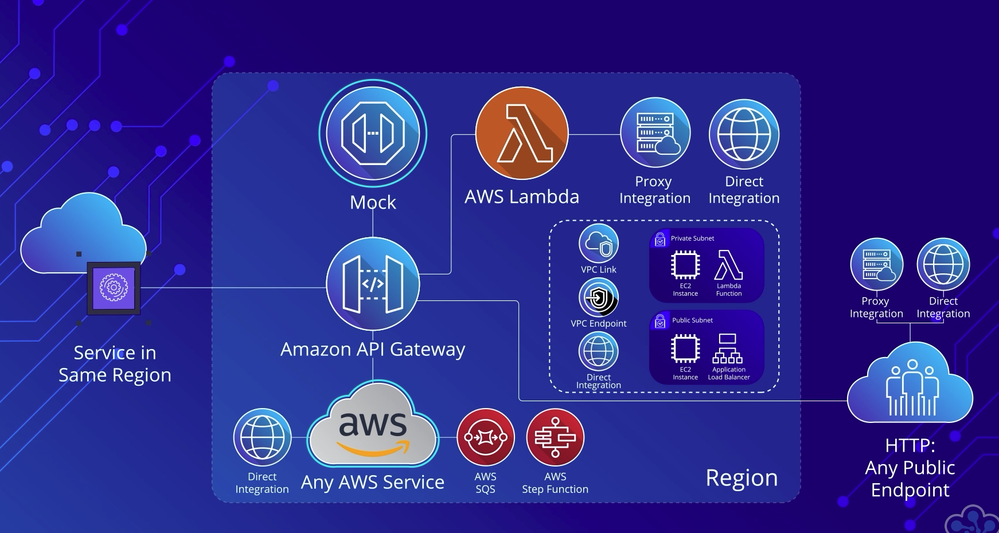
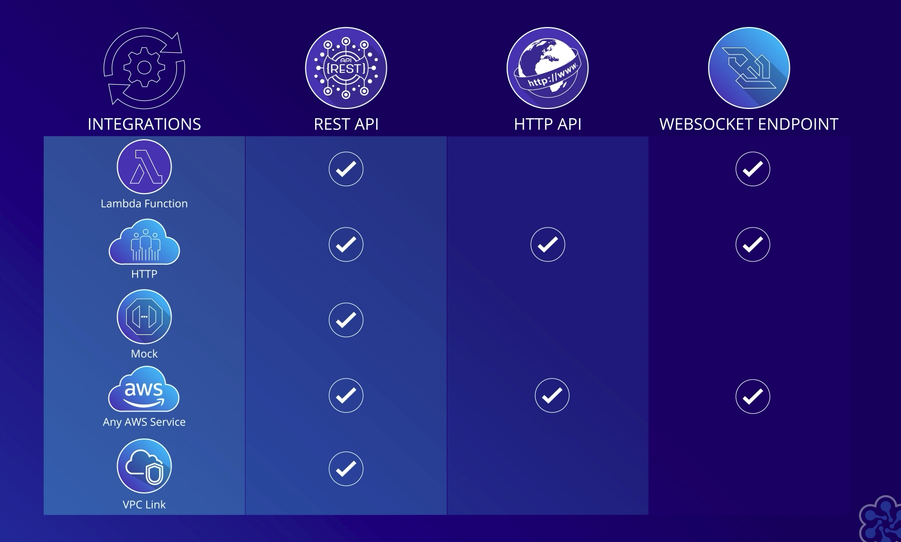
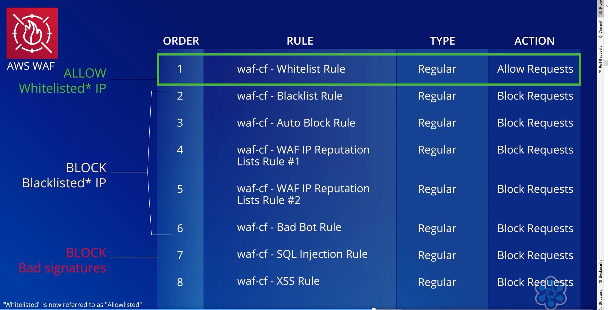
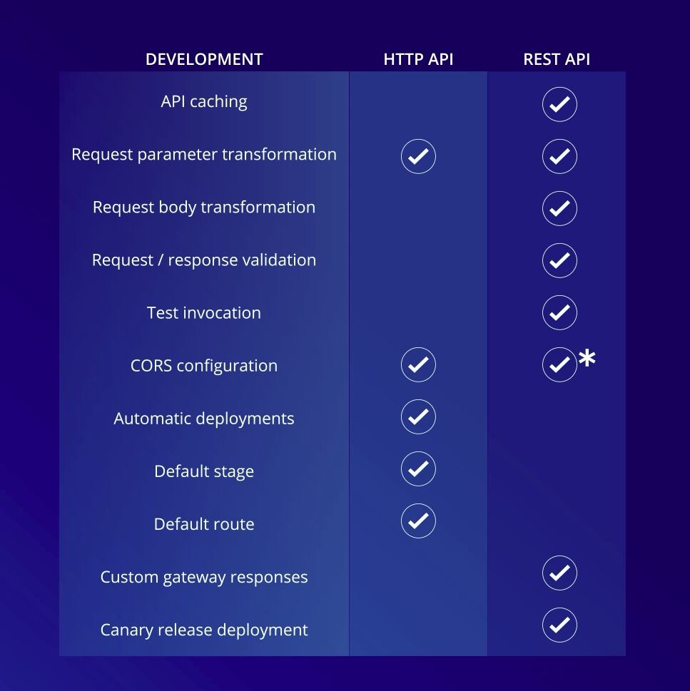
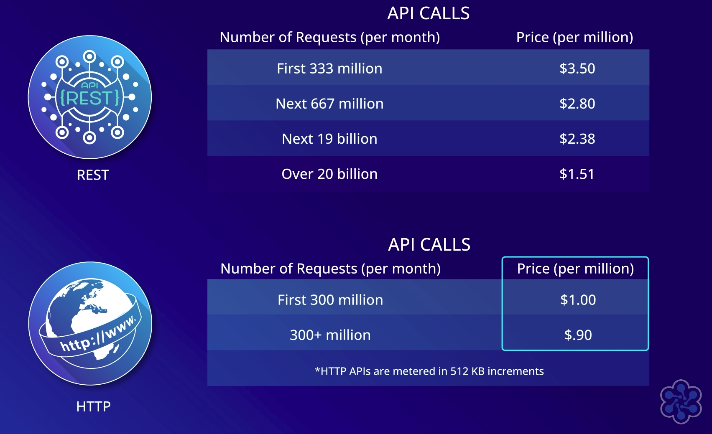
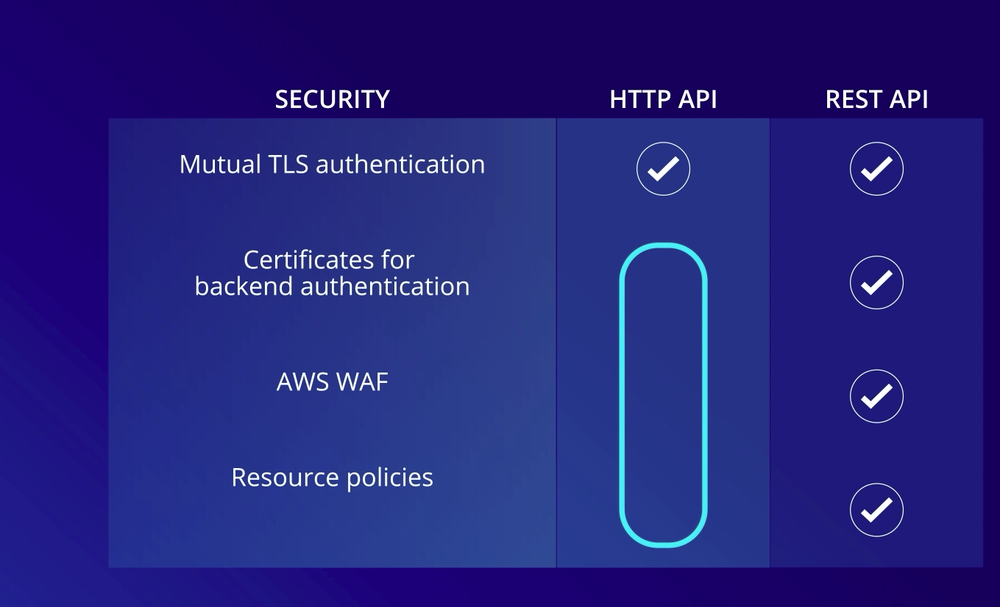

## What is an API?
1. Make easier for applications to interact with
2. The goal of an API is to make interactions with the underlying service easier
3. Analogy is waiter in restaurant + menu.
   1. He does everything, and hide everything
4. ```aws ec2 terminate-instances --instance-ids i-1234343c```
   5. Sample EC2 aws api


## AWS Rest HTTP Methods
1. Get
2. Put
   1. Update existing data
3. POST
   4. New element
4. Delete
* Rest
  1. Representational State Transfer Protocol
  1. Access service only using URL
  1. JSON input and output

## Amazon API Gateway (serverless)

1. Amazon managed service
   1. Building, Publishing, Maintaining, Monitoring and securing
2. Works for
   3. Serverless
   4. Web application
   5. Containerized applications
6. Can handle 100s of 1000s of web-request

## Amazon API Gateway (Endpoints)
1. Edge-Optimized API Endpoint
   1. Routed via cloudfront
   1. Reduces TLS connection overhead
2. Regional API endpoint
   1. If use non-aws CDN (Azure CDN)
   1. No CDN at all 
3. Private API endpoint
   1. Microservices within application 
   1. Within VPC
   1. Internal Dev Teams

## Amazon API Gateway (Protocols)
1. HTTP REST Endpoint
   1. REST API (older version)
   1. HTTP API (newer version)
1. Websocket Endpoint


## REST API (older version)
1. Designed for API management lifecycle
2. Has multiple features APIM
   3. Manage Usage plans
   4. Retirement
   5. Publish
   6. Document
   7. Test
   8. Monetize
   9. Create
   10. Version
   11. Promote
   12. Manage API Keys

## HTTP API (newer version)
1. 70% Cheaper
2. AWS Lambda supports (proxies)
3. HTTP APIs are ideal for: 
   1. building proxy APIs for AWS Lambda or any HTTP endpoint, 
   1. building modern APIs that are equipped with OIDC and OAuth 2 authorization, 
   1. workloads that are likely to grow very large and APIs for latency-sensitive workloads.

## Websocket Endpoint API Gateway
1. This maintains a persistent connection between your backend and the client. 
   1. This is called Duplex Communication. This means that a WebSocket API is good for creating real-time communication between applications. 
1. This might include Chat Apps or streaming type services.
1. This means you can create real-time communication applications without having to deal with managing servers.
1. In general, WebSocket APIs, are pretty use case specific. 

## Integration with API Gateway
1. Proxy vs Direct integration
2. Proxy - easy to integrate
3. Direct Integration
   4. Decouples Amazon API GW for backend request and response payload, headers and status codes
   5. Make changes and not be locked into the backend service responses
6. Integration types
   7. Lambda function integration
   8. HTTP Integration
   9. Mock Integration
   8. AWS service integration
   9. VPC Link Integration
   9. 
   10. 

## API Gateway Authorizer
1. IAM Client Authorizer
1. Lambda Authorizer
1. Cognito Authorizer
1. JWT Authorizer (OIDC)
   2. Anything that supports OAuth 2.0

## API Gateway Security
1. AWS WAF support
2. 

## API Management and Usage
1. Usage plans (REST API Endpoint)
1. APIs keys to usage plan
   3. stay within the plan
1. Caching responses (REST api endpoint alone supports)
   5. Built-in gateway caching
   6. TTL can be between 0 and 3600 seconds
   7. Having a 1 second cache can greatly improve your application
1. Monitors the gateway
   2. 7 types
      3. 4xx count
      4. 5xx count
      5. cache hit count
      6. cache miss count
      7. integration latency
      8. Count (api request)
      9. Latency (Net response)
10. Cloud watch can plot graph

1. 
1. 
1. 
1. 
