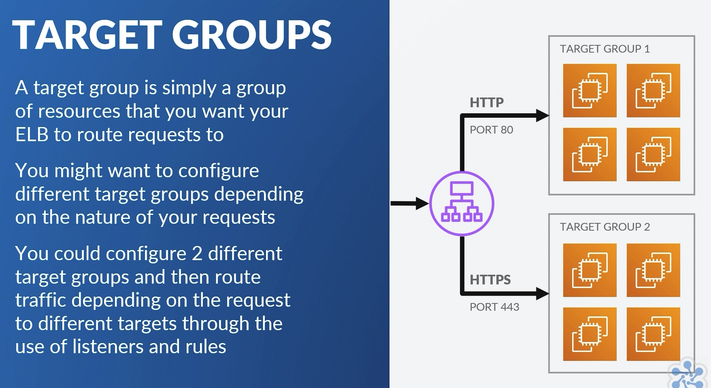
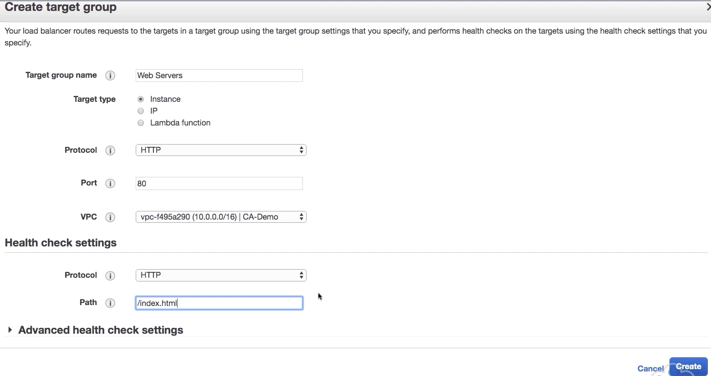
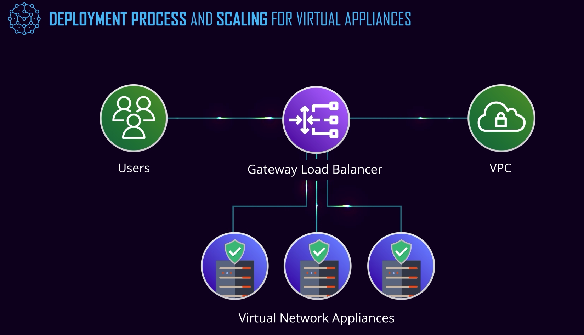

### AWS ELB

* Elastic Load Balancing automatically distributes incoming application traffic across multiple targets, 
  1. Amazon EC2 instances, containers, IP addresses, and Lambda functions. 
* It can handle the varying load of your application traffic in a single Availability Zone or across multiple Availability Zones. 
* Elastic Load Balancing offers three types of load balancers with feature of high availability, automatic scaling, and robust security.
  * Application LB
    * load balancing of HTTP and HTTPS traffic and provides advanced request routing targeted at the delivery of modern application architectures.
    * Operating at the individual request level (Layer 7), Application Load Balancer routes traffic to targets within Amazon Virtual Private Cloud (Amazon VPC) based on the content of the request.
    * Cross zone is by default enabled
  * Network LB
    * Network Load Balancer is best suited for load balancing of Transmission Control Protocol (TCP), User Datagram Protocol (UDP) and Transport Layer Security (TLS) traffic
    * Low latency - millions of request per second
    * Static IP Address is supported
    * Cross zone is by default disabled
  * Classic LB
    * Classic Load Balancer provides basic load balancing across multiple Amazon EC2 instances 
    * Operates at both the request level and connection level. 
    * Classic Load Balancer is intended for applications that were built within the EC2-Classic network.


#### ELB Components
* Listeners 
  * Process that checks for connection request+protocol+port
  * Ports and Protocols set as conditions
  * One or more listener
  * Each listener has one or more rules
* Target groups
  * Target resources
* Rules
  * Network routing rule
    * If source is abc forward to target xyz
  * Configured to each listener
  * Has one or more condition
  * ```bash
    IF
      Source IP is 10.0.0.0/24
      HTTP GET request
    THEN
      Forward to TargetGroup1
    ```
  * source-ip (condition rule) can point a group of ip using 182.32.12.12/32 (subnet address)    
* Health check
  * Specific protocol to check health of resource
* Facing - Internal vs Internet-facing
* ELB Nodes
  * Part of AZ
* Cross Zone LB
  * To distribute request across AZ between target

### Server certificate (For encrypted request)
* To allow ALB to handle traffic over https it requires two things
  * Server certificate
  * Associated security policy
* You can choose/upload certificate from ACM/IAM (4 options)
  * ACM is recommended
  * IAM certificate is available where ACM is not supported
* ACM - Certificate provided by AWS  
* IAM - We can use to handle certificate provided by 3rd party

### ALB
* Layer 7 (OSI model)
  * Types of application - http, ftp, smtp, nfs
  * Request level (not connection level)

### Steps for ELB
1. AWS Management console  
1. EC2 console (under compute)
1. Load balancing section
1. Step-1) Setup target groups
    1. Target-group = name + type (instance/ip/lambda) + protocol + port + vpc + HealthCheck (protocol+port) 
    1. Health-check advanced settings
      1. [healthy-threshold + un-healthy-threshold + timeout + interval + sucess codes]
1. Step-2) select instances for above target groups
1. Step-3) Create LB > ALB
   1. Name
   1. Scheme (internet vs internal)
   1. IP type (V4 vs v6)
   1. Configure Listeners (Port + protocol)
      1. Listener is a process inside load-balancer, that check for connection requests using the protocol and port that we configure.
      2. We can add multiple listener within one load balancer
   1. Select AZ and VPC (subnet)
      1. We can select multiple subnets.
1. Step-4) Create LB > ALB > Configure security settings
   2. Required only if we run process for HTTPS (uploading certificate to ACM, or choosing from ACM)
1. Step-5) Create LB > ALB > Configure security groups
1. Step-6) Create LB > ALB > Configure routing (same as target-group)
1. Step-7) Review and Create
1. We can add multiple rules to target different target groups
2. source-ip (condition rule) can point a group of ip using 182.32.12.12/32 (subnet address)

### ELB can be configured with CloundWatch
1. Alarms can be setup

## Network load balancer (APSTNDP)
* Works at layer 4 (Transport layer/Connection Level)
* Listeners can be any of 
  * TCP, TLS vs UDP
  * Low latency choice and millions of request per second can be handled by a single NLB
* If static IP address is required NLB is the choice
* Cross -zone could be enabled/disabled
* Provisioned in AZ
* Algorithm chooses target based on TCP Sequence, the protocol, source port, source-ip, target-port, target ip
* Creation steps are similar to ELB but need to choose TCP/UDP instead of protocol
* Example: DNS Load Balancer (UDP protocol)


## Classic load balancer (not for exam)
* TCP, SSL, HTTP, HTTPS
* ALB should be preferred over CLB
* Classic network not supported for accounts created after 12-April-2013
* Works when network shared with other customers (without VPC)
* CLB (where ALB won't support)
  * Supports EC2 classic
  * Sticky session using application-generated cookies
  * TCP and ssl listener
* EC2 fleet will be registered directly with the lb.
  * No target autoscaling group

### AWS EC2 autoscaling
* Autoscale using metrics
  * CPU utilization above 80%
  * CPU utilization below 20%
* Scale-out vs Scale-in
* Avoids manual intervention to right scale cloud resources
* Cost reduction and Great customer satisfaction
* Scalable and Flexible architecture
* Groups
  * Your EC2 instances are organized into groups so that they can be treated as a logical unit for the purposes of scaling and management.
  * When you create a group, you can specify its minimum, maximum, and desired number of EC2 instances.

#### AWS EC2 autoscaling - components
1. Launch configuration  - Creation of launch configuration (or Launch template)
   1. Launch template is advanced version of launch configuration
1. Autoscaling Group - Creation of Autoscaling Group
  1. Your group uses a launch configuration as a template for its EC2 instances.
1. Launch configuration
   1. AMI
   1. Instance type
   1. If we need Spot instances
   1. if and when public ip-address
   1. if any user-data on first boot
   1. storage volume configuration
   1. security groups
   1. When you create a launch configuration, you can specify information such as the AMI ID, instance type, key pair, security groups, and block device mapping for your instances.

#### AWS EC2 autoscaling - launch template steps
1. AWS Management console  
1. EC2 console (under compute)
1. Launch template > Create Launch Template
  1. A launch template is similar to a launch configuration, in that it specifies instance configuration information.
  1. Defining a launch template instead of a launch configuration allows you to have multiple versions of a template.
  1. With versioning, you can create a subset of the full set of parameters and then reuse it to create other templates or template versions.
1. Step-1) Launch Template
    1. Create new tempalte
      1. name + description + source-template
    1. Launch template content
        1. AMI, Instance-Type, Key-pair + network type + security groups
        1. Network interface
           1. Device, Network-Interface+subnet+AutoAssignIP+Primary+Secondary+SecGroup
        1. Stoage volumes
        1. Tags
        1. Advanced details
          1. Spot
          1. IAM instance profile-role of ec2 instance
          1. Shutdown behavior
        1. User data (any user commands on boot)
1. Launch configuration
  1. Similar to launch configuration
  1. We can select IAM role (in LT - instance profile)        
  1. Ramdisk is possible
  1. Key-pair

#### AWS EC2 autoscaling group
1. It is bridge between LB and TargetGroup.
   1. There could be multiple targetgroup in one auto-scaling group
   1. 
   1. 
2. Launch configuration/template is mandatory for auto-scaling group
1. Desired capacity and other limitations
1. In which AZ to scale?
1. Steps
  1. EC2 management console > AutoScaling Groups > Create ASG
  1. Choose LC/LT and version
  1. Fleet composition (LT vs combine purchase options)
  1. Choose VPC subnet
  1. Advance details
    1. LB
       1. Combine ELB vs Autoscaling group
       1. Select the target-group in AutoScaling group to tie the ELB
    1. Health check grace period
    1. Instance protection
    1. Service linked role  
  1. Scaling policy
    1. Number of instances between 2 and 8
    1. We can choose step of simple scaling policy
    1. Increasing group size vs decreasing group size using alarm
    1. Create alarm
       1. Avg CPU utilization is over 75% for consecutive period of 5 minutes (1 count)
    1. Add notification type
        1. launch, terminate, fail to launch or fail to terminate
1. Create
    

## CloudWatch
* By default, CloudWatch monitors EC2 instances approximately every 5 minutes. 
  * Detailed monitoring enables monitoring more often (each minute). Note: Detailed monitoring does have an associated cost.
* Cooldown period - The cool down period helps you prevent your Auto Scaling group from launching or terminating additional instances before the effects of previous activities are visible. 
  * You can configure the length of time based on your instance startup time or other application needs. 

## Gateway load balancer
1. 


### Lab
* 257937829427/student/Ca1_3X1Kh4ha
* 
```
#!/bin/bash
#Enable the epel-release
amazon-linux-extras install epel
#Install and start Apache web server
yum install -y httpd php
service httpd start
#Install CPU stress test tool
sudo yum install -y stress
```

###
chmod 700 ec2_challenge_1.pem
ssh -i "ec2_challenge_1.pem" ec2_user@ec2-54-68-106-177.us-west-2.compute.amazonaws.com

### To stress CPU
stress -c 2 -i 1 -m 1 --vm-bytes 128M -t 5m

###[ELB Product comparisons](https://aws.amazon.com/elasticloadbalancing/features/)  
###[What Is Amazon EC2 Auto Scaling?](https://docs.aws.amazon.com/autoscaling/latest/userguide/WhatIsAutoScaling.html)
### (https://docs.aws.amazon.com/autoscaling/ec2/userguide/as-suspend-resume-processes.html)